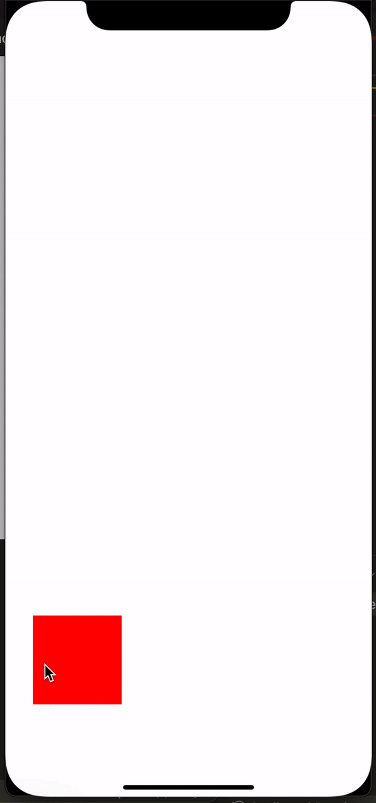

# React Native Draggable Reanimated
[](https://badge.fury.io/js/react-native-draggable-reanimated)    
#### This package help you easy to drag any view

---
This package requires these, please make sure you had installed them:
- [react-native-gesture-handler](https://github.com/software-mansion/react-native-gesture-handler)
- [react-native-reanimated V2](https://github.com/software-mansion/react-native-reanimated)

## Demo



## Getting started

`$ npm install react-native-draggable-reanimated --save`

- OR

`$ yarn add react-native-draggable-reanimated`

- All in one

`$ npm install react-native-draggable-reanimated react-native-gesture-handler react-native-reanimated --save && cd ios && pod install`

## Usage
```javascript
import DraggableView from 'react-native-draggable-reanimated';

<DraggableView
	initValue={{ x: 100, y: 100 }}
	onRelease={(val) => {
		console.log(val);
	}}>
	<View
		style={{
			backgroundColor: 'red',
			width: BOX_SIZE,
			height: BOX_SIZE,
		}}
	/>
</DraggableView>

```


## License

This module is [MIT licensed](./LICENSE)

---
  
